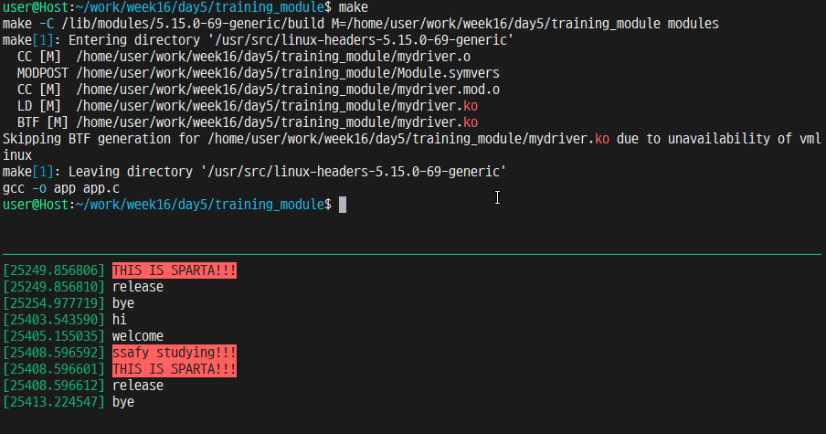

# Device Driver 만들기
## 커널 등록 순서
- Device File 생성
    - ```sudo mknod /dev/<device_name> c 100 0```
    - ```sudo chmod 666 /dev/<device_name>```

- Device Driver 커널에 등록
    - ```sudo insmod <Kernel Module File>```

- Device Driver 커널에서 제거
    - ```sudo rmmod <device_name>```

## driver.c
### .open
application에서 driver 파일 open할 때 호출
```c
static int driver_open(struct inode* inode, struct file *filp)
```
### .release
application에서 driver 파일 close할 때 호출
```c
static int driver_release(struct inode *inode, struct file *filp)
```

### .read
device file에서 데이터를 읽을 때 사용
```c
static ssize_t driver_read(struct file *filp, char *buf, size_t count, loff_t *ppos)
```
read(fd, buf, sizeof(buf))
### .write
device file에서 데이터를 쓸 때 사용
```c
static ssize_t mydriver_write(struct file *filp, const char *buf, size_t count, loff_t *ppos)
```
write(fd, buf, sizeof(buf))

### .unlocked_ioctl
read, write는 byte 단위 값 전달 받을 때 주로 사용
ioctl(input output control)은 제어, 설정 용도로 사용
```c
static long mydriver_ioctl(struct file *filp, unsigned int cmd, unsigned long arg)
```
ioctl(fd, cmd, arg);
driver에서는 cmd를 case로 나누어 처리


## 예제
### ioctl demo

1. 구조체를 만든다
2. user 영역에서 kernel 영역으로 data 전송 (ioctl)
3. kernel 영역에서 data 수정
4. kernel 영역에서 user 영역으로 data 전송 (ioctl)
5. 출력하여 결과 확인


### app.c
```C
#include <stdio.h>
#include <stdlib.h>
#include <unistd.h>
#include <sys/types.h>
#include <sys/stat.h>
#include <fcntl.h>
#include <sys/ioctl.h>

struct Node{
	int age;
	char name[100];
}user;

int main() {
    int fd = open("/dev/nobrand", O_RDWR);
    if (fd < 0) {
        printf("ERROR, no device\n");
        exit(1);
    }

	//read
    char buff[100];
    read(fd, buff, 100);
    printf("%s\n", buff);

    //write
    char buff[100] = "hello";
    write(fd, buff, 100);

    //ioctl
    printf("Welcome to SSAFY!\n");

    printf("What's your name? : ");
    scanf("%s", user.name);
    printf("how old are u? : ");
    scanf("%d", &user.age);

    printf("SSAFY studying ...\n");
    ioctl(fd, _IO(0, 3), 0);
    printf("SSAFY graduate ...\n");
    ioctl(fd, _IO(0, 4), &user);

    printf("%s (%d)\n", user.name, user.age);
    printf("Bye!\n");

    close(fd);
    return 0;
}

```

## mydriver.c
```c
#include <linux/module.h>
#include <linux/fs.h>
#include <linux/uaccess.h>

#define NOD_MAJOR 100
#define NOD_NAME "mydriver"

MODULE_LICENSE("GPL");

struct Node{
	int age;
	char name[100];
};

static int mydriver_open(struct inode *inode, struct file *filp) {
	printk( KERN_INFO "welcome\n");
	return 0;
}

static int mydriver_release(struct inode *inode, struct file *filp) {
	printk( KERN_INFO "release\n");
	return 0;
}

static ssize_t mydriver_read(struct file *filp, char *buf, size_t count, loff_t *ppos) {
	buf[0] = 'h';
	buf[1] = 'i';
	buf[2] = '\0';
	return count;
}

static ssize_t mydriver_write(struct file *filp, const char *buf, size_t count, loff_t *ppos) {
	printk( KERN_INFO "app msg : %s\n", buf);
	return count;
}

static long mydriver_ioctl(struct file *filp, unsigned int cmd, unsigned long arg) {
	struct Node user;
	struct Node* userp = &user;
	int ret;
	void *p = (void *)(arg);
	switch(cmd) {
		case _IO(0, 3):
			printk( KERN_ALERT "ssafy studying!!!\n");
			break;
		case _IO(0, 4):
			ret = copy_from_user((void *)userp, p, sizeof(struct Node));
			userp->age++;
			ret = copy_to_user((void *)arg, (void*)userp, sizeof(struct Node));
			printk( KERN_ALERT "THIS IS SPARTA!!!\n");
			printk( KERN_INFO "%sis grow up!, %d!!\n", userp->name, userp->age);
			break;
		default:
			return -EINVAL;
	}
	return 0;
}

static struct file_operations fops = {
	.open = mydriver_open,
	.release = mydriver_release,
	.read = mydriver_read,
	.write = mydriver_write,
	.unlocked_ioctl = mydriver_ioctl,
};

static int mydriver_init(void) {
	if( register_chrdev(NOD_MAJOR, NOD_NAME, &fops) < 0) {
		printk("INIT FAIL\n");
	}
	printk( KERN_INFO "hi\n");
	return 0;
}

static void mydriver_exit(void) {
	unregister_chrdev(NOD_MAJOR, NOD_NAME);
	printk( KERN_INFO "bye\n");
}

module_init(mydriver_init);
module_exit(mydriver_exit);
```