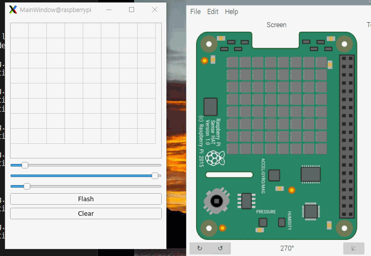

# QT를 활용한 SenseHat LED Controller

SenseHat LED를 Control 할 수 있는 리모컨을 만들었다.

# 작동 설명
## 사용된 기술 스택
- Python
- Pyside6
- RaspberryPi
- SenseHat (emulator)

## 구성
1. lighting_ui.py 에서 GUI를 구성한다.
    - table: 8x8 사이즈의 선택창으로, 각각 SenseHat의 LED에 연결되어 있다.
    - slidebar: 총 3가지로, 각각 RGB 색상을 0-255로 선택한다.
    - flash 버튼: 모든 LED를 선택된 색상으로 설정한다.
    - clear 버튼: 모든 LED를 끈다.

2. lighting.py 에서 동작을 실행한다.
    - 1 에서 만들어진 GUI창을 띄워준다.
    - 각 기능에 맞는 함수를 만들어주고, 연결해준다.

3. SenseHat emulator는 SenseHat 동작을 보여준다.

# 데모
