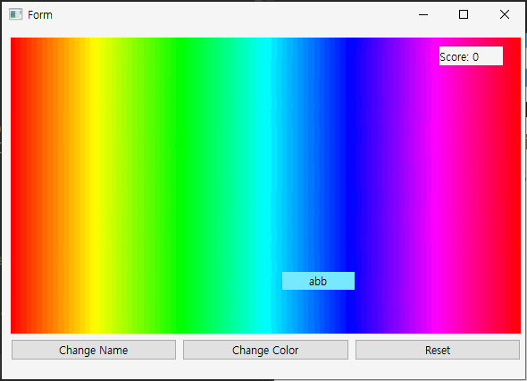

# QT를 활용한 마우스 트레이닝 게임

## 데모


## 설명
### GUI
Form 구성
- ```Frame```
    - label1: 점수를 나타내는 레이블
    - label2: 클릭 해야 하는 타겟 레이블
- ```Button```
    - Button1: 이름을 바꾼다.
    - Button2: 타겟의 색을 바꾼다.
    - button3: 점수를 reset한다.

### 동작
Label은 0.6초마다 Frame 내 랜덤한 위치로 이동한다.
움직이는 Label을 클릭 시 점수가 증가한다.
Reset을 누르면 점수가 초기화된다.