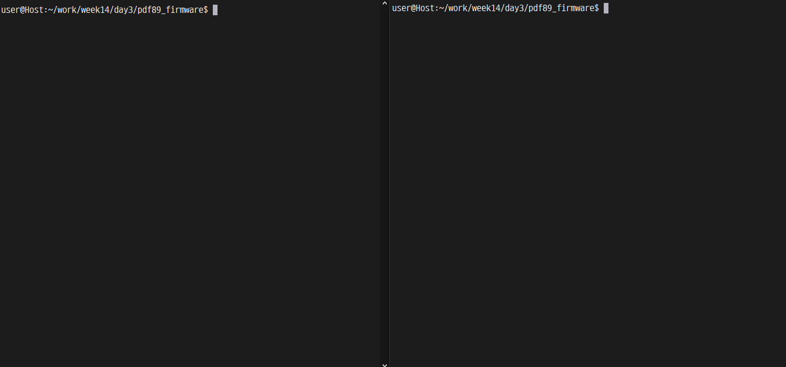

# Signal 핸들링 firmware 제작
프로그램 동작 중 Signal Handling하는 모습을 보여준다.

## 구성
- firmware:
    A부터 Z까지, Z부터 A 출력하는 프로그램.
    다음과 같은 핸들러가 있다.
    * SIGUSR1: [SIGUSR1]을 출력
    * SIGUSR2: 버퍼를 비워준다 (clear 명령과 같은 동작)
    * SIGTERM: BYE를 출력하고, 프로그램을 종료한다.

- person:
    person \<pid\> 형태로 사용
    pid에 해당하는 프로세스에 1, 2, 3에 각각 SIGUSR1, SIGUSR2, SIGTERM 세가지 signal을 보낸다.

## 동작

