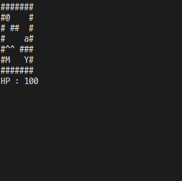

#ncurses를 이용한 게임 제작

## 게임 설명
 - #: 벽
    - 벽으로는 이동할 수 없다.
 - @: 캐릭터
    - 캐릭터는 화살표로 움직일 수 있다.
 - M: 몬스터
    - 몬스터는 0.5초마다 랜덤 방향으로 움직인다.
    - 캐릭터가 몬스터를 만나면 **GAME OVER**
 - ^: 가시
    - 가시는 밟으면 hp가 10씩 줄어든다.
    - hp가 0 이하가 되면 **GAME OVER**
 - a: 사과
    - 사과를 먹으면 hp가 전부 회복된다.
 - Y: 목표
    - 목표에 도착하면 게임 승리 **WIN**

## 데모 영상

