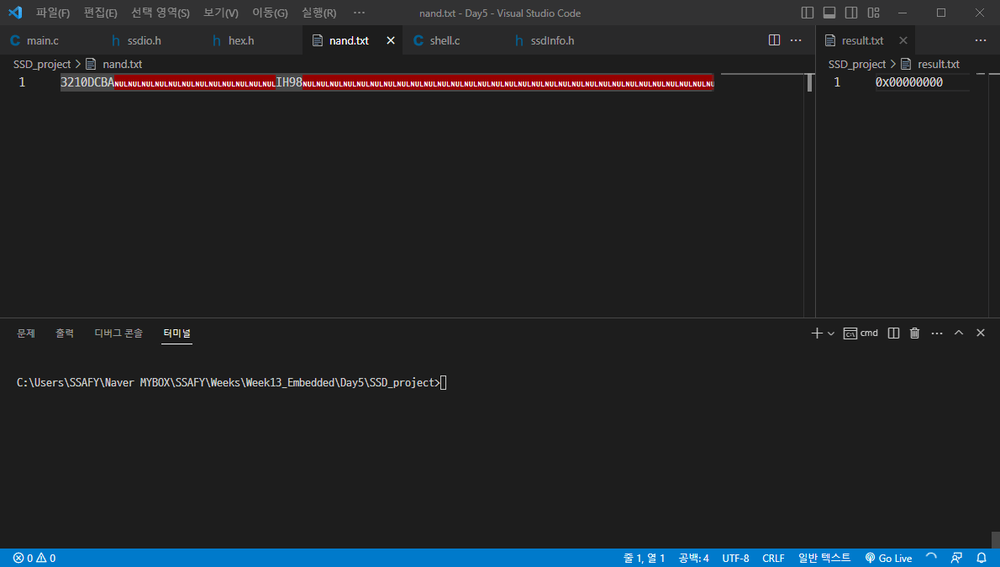

# SSD 구현 프로젝트

## 명령어
- write: ssd W \<address\> \<value\>
\<address\> 영역에 \<value\>를 저장
- read: ssd R \<address\>
\<address\>의 값을 읽어 result.txt에 저장

## 구현 방식
Little endian 방식이며, LBA의 크기는 4byte

## 데모 영상

